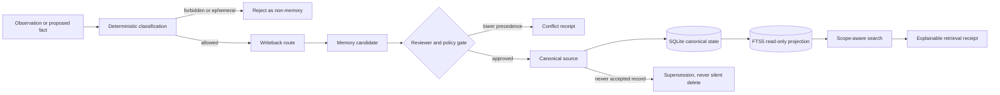

# Agent Memory Control Plane

[Русская версия](README.ru.md)

A local-first governance layer for AI-agent memory: deterministic routing, explicit ownership, review before promotion, scope-aware retrieval, conflict handling, and auditable receipts.

This is **not another vector-memory demo**. It answers the harder operational questions:

- What is worth remembering?
- Which source owns the truth?
- Where should a proposed change be written?
- Who may read or promote it?
- Why did a record appear in retrieval?
- What happens when two sources disagree?

## Why it exists

A single assistant can survive on chat history. A multi-agent team cannot. Runtime messages, stable user preferences, operating procedures, team policy, and public knowledge have different owners, retention rules, and visibility boundaries. Mixing them into one searchable bucket creates stale answers, privacy leaks, and silent overrides.

Agent Memory Control Plane makes that lifecycle explicit and testable.

## Architecture



The CLI and the isolated MCP adapter both pass through the same `ControlPlane` mutation boundary. Policy is packaged as YAML; contracts are expressed as JSON Schemas; SQLite stores canonical state and an append-only audit ledger; FTS5 is a rebuildable read-only projection.

## What is real and useful here

This repository is a runnable reference implementation, not a slide deck or scaffold. It demonstrates:

1. **Deterministic classification and writeback routing** for stable facts, procedures, governance, and non-memory runtime evidence.
2. **Candidate-first writes**: no model or agent writes directly into canonical memory.
3. **Capability and provenance gates**: actor, source, owner, and scope must match policy both at proposal and promotion time.
4. **Source precedence**: lower-priority memory cannot overwrite higher-priority truth, even with identical content.
5. **Conflict and supersession receipts** instead of silent merge or deletion.
6. **Scope-aware retrieval** for `private`, `team`, and `public` records.
7. **Explainable results** with source, owner, scope, confidence, update time, retrieval reason, writeback target, and conflict/staleness signals.
8. **Local-only operation** with SQLite/FTS5 and no mandatory cloud, graph database, or embedding service.
9. **Seven MCP tools** that reuse the same policy boundary as the CLI.
10. **Synthetic runnable scenarios** for a personal assistant, a multi-agent team, and a public/private boundary.

## Guarantees and non-guarantees

### What the baseline enforces

- fail-closed actor, source, owner, and scope checks;
- dry-run by default for proposals and promotions;
- explicit `--apply` for mutation;
- no automatic merge, delete, or lower-priority override;
- no raw-session indexing;
- no direct LLM write path;
- local-only storage in the baseline;
- auditable proposal and promotion events;
- reproducible health and privacy checks.

### What it does not promise

No memory system can honestly guarantee that an agent will **never** forget or that infrastructure will **always** work. This project reduces silent forgetting and drift by making ownership, promotion, retrieval, and health visible. Production operators still need backups, monitoring, policy review, and tested recovery.

It also does not provide semantic similarity in the baseline, cloud synchronization, automatic connector installation, or a production database migration framework.

## Quick start

Requirements: Python 3.11+.

```bash
python3 -m venv .venv
.venv/bin/python -m pip install .
.venv/bin/amcp init
.venv/bin/amcp classify --dry-run "A procedure with step one"
.venv/bin/amcp propose greeting "Public onboarding guide" \
  --source public-knowledge --owner researcher --scope public \
  --actor researcher --apply
.venv/bin/amcp promote 1 --reviewer reviewer --apply
.venv/bin/amcp search onboarding --actor public_reader
.venv/bin/amcp explain 1 --actor public_reader
.venv/bin/amcp conflicts
.venv/bin/amcp audit
.venv/bin/amcp doctor
.venv/bin/amcp-mcp --list-tools
.venv/bin/python examples/run_scenarios.py
```

`propose` and its `ingest` alias are dry-run by default. `promote` is also dry-run unless `--apply` is present. The safe default route creates a private candidate owned by `assistant` in `profile-memory`; explicit source arguments must exactly match the source manifest and actor capability.

## CLI surface

| Command | Purpose |
|---|---|
| `init` | Create the local database and source registry |
| `classify --dry-run` | Classify input and show its writeback route |
| `propose` / `ingest` | Validate and optionally persist a candidate |
| `promote` | Apply reviewer, precedence, and provenance gates |
| `search` | Run FTS5 retrieval with scope filtering |
| `explain` | Return the retrieval receipt for a record |
| `conflicts` | List open conflicts |
| `audit` | Show canonical and audit-ledger counts |
| `doctor` | Run fail-closed health checks |

## MCP adapter

`amcp-mcp` is a dependency-free JSON-RPC stdio adapter. It exposes:

- `memory_search`
- `memory_explain`
- `memory_propose`
- `memory_promote`
- `memory_conflicts`
- `memory_source_get`
- `memory_health`

The adapter does not expand privileges or install a connector. Every call is handled by the same policy-aware control plane.

## Privacy and anonymization

The implementation, tests, policies, demo traces, roles, and examples are synthetic and generic. They do not contain private conversations, real agent rosters, local production paths, chat IDs, credentials, private repositories, or owner-context records.

The public resource links below are intentional public attribution, not runtime data. Release checks scan both the working tree and reachable Git history for private paths, credential patterns, email addresses, high-risk identifiers, and non-generic commit identities.

Run the gate locally:

```bash
python scripts/public_scan.py --history
```

## Documentation

### English

- [Architecture](docs/en/architecture.md)
- [Source hierarchy](docs/en/source-hierarchy.md)
- [Privacy and threat model](docs/en/privacy-threat-model.md)
- [Memory lifecycle](docs/en/memory-lifecycle.md)
- [Team interaction](docs/en/team-interaction.md)
- [Comparison boundaries](docs/en/comparison-boundaries.md)
- [Verification and rollback](docs/en/verification-rollback.md)

### Русский

- [Архитектура](docs/architecture.md)
- [Иерархия источников](docs/source-hierarchy.md)
- [Privacy model и threat model](docs/privacy-threat-model.md)
- [Lifecycle памяти](docs/memory-lifecycle.md)
- [Взаимодействие команды](docs/team-interaction.md)
- [Границы сравнения](docs/comparison-boundaries.md)
- [Проверка и rollback](docs/verification-rollback.md)

Additional artifacts: [contributor guide](CONTRIBUTING.md) and [synthetic demo traces](docs/demo-traces.json).

## Public resources

- [YouTube — AI agents and automation](https://youtube.com/@alekseiulianov)
- [Telegram — SPRUT_AI](https://t.me/Sprut_AI)
- [Telegram community chat](https://t.me/+eH-qNIDmud8zNDZi)
- [AI Операционка](https://t.me/tribute/app?startapp=sJyg)
- [GitHub — AlekseiUL](https://github.com/AlekseiUL)

## License

[MIT](LICENSE). Use the code as a reference implementation, keep the safety boundaries explicit, and do not present it as a guarantee of perfect memory or uninterrupted operation.