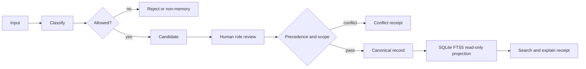

# Agent Memory Control Plane

Локальный control plane для управляемой памяти AI-агентов. Это не vector-memory demo: продукт отвечает, что допустимо помнить, кто владеет истиной, куда направлять изменение, кто может читать запись и почему запись попала в retrieval.

## Свойства MVP

- Python 3.11+, SQLite/FTS5, без облака и обязательных внешних зависимостей.
- Deterministic classification и policy-as-code.
- Candidate → review → promotion → canonical record → read-only index → retrieval receipt.
- Precedence, conflict и supersession без автоматического merge/delete.
- Scope enforcement для `private`, `team`, `public`.
- CLI и изолированный JSON-RPC stdio MCP adapter.
- Только синтетические сценарии.

## Quickstart

```bash
python3 -m venv .venv
.venv/bin/python -m pip install .
.venv/bin/amcp init
.venv/bin/amcp classify --dry-run "A procedure with step one"
.venv/bin/amcp propose greeting "Public onboarding guide" --source public-knowledge --owner researcher --scope public --actor researcher --apply
.venv/bin/amcp promote 1 --reviewer reviewer --apply
.venv/bin/amcp search onboarding --actor public_reader
.venv/bin/amcp explain 1 --actor public_reader
.venv/bin/amcp conflicts
.venv/bin/amcp audit
.venv/bin/amcp doctor
.venv/bin/amcp-mcp --list-tools
.venv/bin/python examples/run_scenarios.py
```

`propose` и его alias `ingest` являются dry-run по умолчанию. Мутация происходит только с `--apply`. Actor обязан быть зарегистрирован в policy и иметь capability для выбранного source; owner и scope должны точно совпадать с source manifest. Без явных source-параметров безопасный default создаёт private candidate от `assistant` в `profile-memory`. `promote` также dry-run без `--apply` и повторно проверяет proposal boundary.

## Поток



## Команды

| Команда | Назначение |
|---|---|
| `init` | Создать локальную БД и source registry |
| `classify --dry-run` | Определить класс и writeback route |
| `propose` / `ingest` | Предложить candidate; `--apply` сохраняет |
| `promote` | Проверить precedence и явно продвинуть |
| `search` | FTS5 retrieval с фильтром scope |
| `explain` | Полный retrieval receipt |
| `conflicts` | Открытые конфликты |
| `audit` | Счётчики состояния и audit ledger |
| `doctor` | Fail-closed health checks |

## Документация

- [Архитектура](docs/architecture.md)
- [Иерархия источников](docs/source-hierarchy.md)
- [Privacy model и threat model](docs/privacy-threat-model.md)
- [Lifecycle памяти](docs/memory-lifecycle.md)
- [Взаимодействие команды](docs/team-interaction.md)
- [Границы сравнения](docs/comparison-boundaries.md)
- [Проверка и rollback](docs/verification-rollback.md)
- [Contributor guide](CONTRIBUTING.md)
- [Demo traces](docs/demo-traces.json)

## MCP adapter

`amcp-mcp` использует JSON-RPC по stdin/stdout и не устанавливает connector автоматически. Tools: `memory_search`, `memory_explain`, `memory_propose`, `memory_promote`, `memory_conflicts`, `memory_source_get`, `memory_health`.

## Границы

Репозиторий не индексирует transcript/session evidence, не принимает secrets, не даёт LLM прямую запись, не подключается к cloud и не обещает semantic similarity без опционального внешнего слоя. Публикация не является частью локального MVP.
