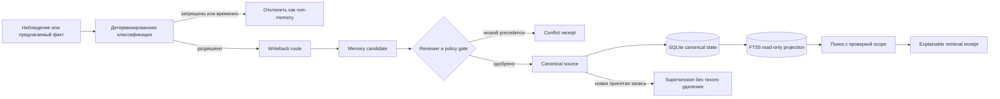

# Agent Memory Control Plane

[English version](README.md)

Локальный governance-слой для памяти AI-агентов: детерминированная маршрутизация, явный владелец истины, review перед promotion, scope-aware retrieval, обработка конфликтов и проверяемые receipts.

Это **не ещё одна демонстрация vector memory**. Репозиторий отвечает на более сложные операционные вопросы:

- Что вообще стоит запоминать?
- Какой источник владеет истиной?
- Куда направить предлагаемое изменение?
- Кто может читать или продвигать запись?
- Почему запись попала в retrieval?
- Что происходит, когда источники противоречат друг другу?

## Зачем это нужно

Один ассистент иногда может жить на истории чата. Команда агентов — нет. Runtime-сообщения, стабильные предпочтения пользователя, процедуры, командная policy и публичные знания имеют разных владельцев, сроки жизни и границы видимости. Если сложить всё в одну поисковую корзину, появляются устаревшие ответы, утечки и тихие перезаписи истины.

Agent Memory Control Plane делает весь lifecycle явным и проверяемым.

## Архитектура



CLI и изолированный MCP adapter проходят через одну mutation boundary — `ControlPlane`. Policy поставляется в YAML, контракты описаны JSON Schemas, SQLite хранит canonical state и append-only audit ledger, а FTS5 является пересобираемой read-only projection.

## Какая здесь реальная польза

Это работающая reference implementation, а не презентация или scaffold. Она показывает:

1. **Детерминированную классификацию и writeback routing** для стабильных фактов, процедур, governance и временных runtime events.
2. **Candidate-first запись**: модель или агент не меняет canonical memory напрямую.
3. **Capability и provenance gates**: actor, source, owner и scope проверяются и при proposal, и при promotion.
4. **Source precedence**: нижний источник не может переписать верхнюю истину даже идентичным текстом.
5. **Conflict и supersession receipts** вместо тихого merge или удаления.
6. **Scope-aware retrieval** для `private`, `team` и `public`.
7. **Объяснимый результат**: source, owner, scope, confidence, updated time, retrieval reason, writeback target и conflict/staleness signals.
8. **Локальную baseline-работу** на SQLite/FTS5 без обязательного облака, graph DB или embeddings.
9. **Семь MCP tools**, использующих ту же policy boundary, что и CLI.
10. **Три синтетических запускаемых сценария**: личный ассистент, команда агентов и public/private boundary.

## Гарантии и ограничения

### Что baseline действительно обеспечивает

- fail-closed проверки actor, source, owner и scope;
- dry-run по умолчанию для proposal и promotion;
- явный `--apply` для мутации;
- отсутствие автоматических merge, delete и lower-priority override;
- отсутствие автоматической индексации raw sessions;
- отсутствие прямой LLM write path;
- локальное хранение в baseline;
- audit events для proposal и promotion;
- воспроизводимые health и privacy checks.

### Чего система не обещает

Ни одна система памяти не может честно гарантировать, что агент **никогда** ничего не забудет или инфраструктура **всегда** будет работать. Этот проект снижает риск тихого забывания и drift: делает видимыми ownership, promotion, retrieval и health. В production всё равно нужны backups, monitoring, policy review и проверенное восстановление.

Baseline также не включает semantic similarity, cloud synchronization, автоматическую установку connector или production migration framework.

## Быстрый старт

Требование: Python 3.11+.

```bash
python3 -m venv .venv
.venv/bin/python -m pip install .
.venv/bin/amcp init
.venv/bin/amcp classify --dry-run "A procedure with step one"
.venv/bin/amcp propose greeting "Public onboarding guide" \
  --source public-knowledge --owner researcher --scope public \
  --actor researcher --apply
.venv/bin/amcp promote 1 --reviewer reviewer --apply
.venv/bin/amcp search onboarding --actor public_reader
.venv/bin/amcp explain 1 --actor public_reader
.venv/bin/amcp conflicts
.venv/bin/amcp audit
.venv/bin/amcp doctor
.venv/bin/amcp-mcp --list-tools
.venv/bin/python examples/run_scenarios.py
```

`propose` и alias `ingest` работают как dry-run по умолчанию. `promote` также ничего не меняет без `--apply`. Без явных source-параметров безопасный маршрут создаёт private candidate владельца `assistant` в `profile-memory`; явные параметры должны точно совпадать с source manifest и capability агента.

## CLI

| Команда | Назначение |
|---|---|
| `init` | Создать локальную БД и registry источников |
| `classify --dry-run` | Классифицировать вход и показать writeback route |
| `propose` / `ingest` | Проверить и при необходимости сохранить candidate |
| `promote` | Применить reviewer, precedence и provenance gates |
| `search` | Выполнить FTS5 retrieval с фильтром scope |
| `explain` | Вернуть retrieval receipt записи |
| `conflicts` | Показать открытые конфликты |
| `audit` | Показать счётчики canonical state и audit ledger |
| `doctor` | Запустить fail-closed health checks |

## MCP adapter

`amcp-mcp` — dependency-free JSON-RPC stdio adapter. Он предоставляет:

- `memory_search`
- `memory_explain`
- `memory_propose`
- `memory_promote`
- `memory_conflicts`
- `memory_source_get`
- `memory_health`

Adapter не расширяет права и не устанавливает connector. Все вызовы проходят через тот же policy-aware control plane.

## Privacy и анонимизация

Код, тесты, policies, demo traces, роли и примеры синтетические и generic. В них нет приватных переписок, реального roster агентов, локальных production paths, chat IDs, credentials, private repositories и owner-context records.

Публичные ссылки ниже — намеренная публичная атрибуция, а не runtime data. Release gate проверяет working tree и всю достижимую Git history на локальные пути, credentials, email, high-risk identifiers и негeneric commit identity.

```bash
python scripts/public_scan.py --history
```

## Документация

### Русский

- [Архитектура](docs/architecture.md)
- [Иерархия источников](docs/source-hierarchy.md)
- [Privacy model и threat model](docs/privacy-threat-model.md)
- [Lifecycle памяти](docs/memory-lifecycle.md)
- [Взаимодействие команды](docs/team-interaction.md)
- [Границы сравнения](docs/comparison-boundaries.md)
- [Проверка и rollback](docs/verification-rollback.md)

### English

- [Architecture](docs/en/architecture.md)
- [Source hierarchy](docs/en/source-hierarchy.md)
- [Privacy and threat model](docs/en/privacy-threat-model.md)
- [Memory lifecycle](docs/en/memory-lifecycle.md)
- [Team interaction](docs/en/team-interaction.md)
- [Comparison boundaries](docs/en/comparison-boundaries.md)
- [Verification and rollback](docs/en/verification-rollback.md)

Дополнительно: [contributor guide](CONTRIBUTING.md) и [синтетические demo traces](docs/demo-traces.json).

## Публичные ресурсы

- [YouTube — AI-агенты и автоматизация](https://youtube.com/@alekseiulianov)
- [Telegram — SPRUT_AI](https://t.me/Sprut_AI)
- [Telegram-чат сообщества](https://t.me/+eH-qNIDmud8zNDZi)
- [AI Операционка](https://t.me/tribute/app?startapp=sJyg)
- [GitHub — AlekseiUL](https://github.com/AlekseiUL)

## Лицензия

[MIT](LICENSE). Используйте код как reference implementation, сохраняйте явные safety boundaries и не выдавайте его за гарантию идеальной памяти или бесперебойной работы.
