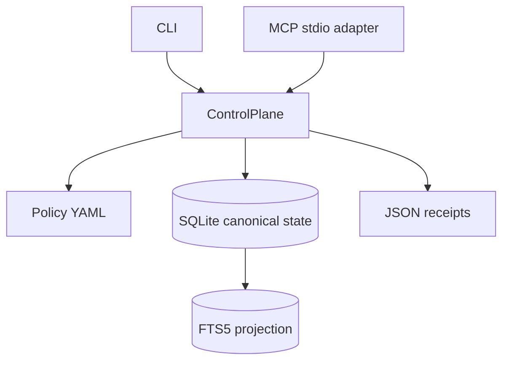

# Архитектура

`ControlPlane` — единственная mutation boundary. Policy загружается из package resources. SQLite хранит registry источников, candidates, canonical records, conflicts и append-only audit events. FTS5 — rebuildable read-only projection canonical records.

Base mode не использует сеть. JSON Schemas и policy YAML поставляются внутри wheel через `importlib.resources`. MCP adapter отделён от connector/runtime и работает как bounded stdio process.
