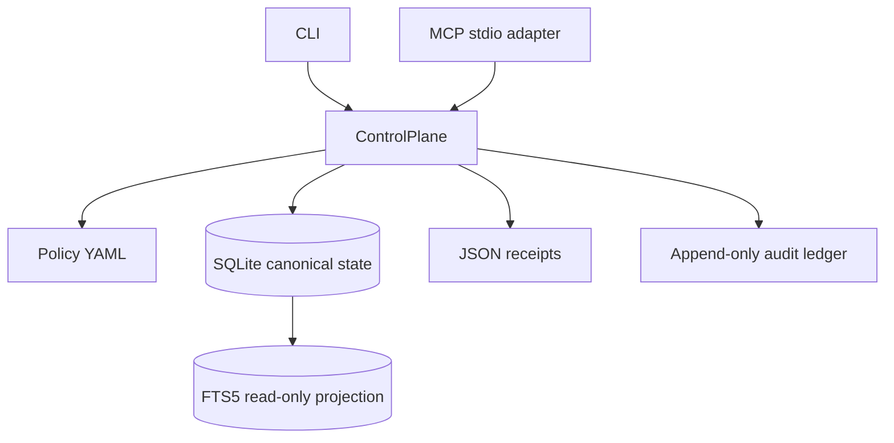

# Architecture

`ControlPlane` is the single mutation boundary. The CLI and MCP adapter call it instead of accessing storage directly. Policy is loaded from packaged resources.

SQLite stores the source registry, candidates, canonical records, conflicts, and audit events. FTS5 contains only active canonical records and can be rebuilt. The baseline performs no network calls. JSON Schemas and policy YAML are included in the wheel through `importlib.resources`.

The MCP adapter is an isolated bounded stdio process. It is transport, not authority: every tool call passes through the same actor, source, owner, scope, precedence, and mutation checks.
