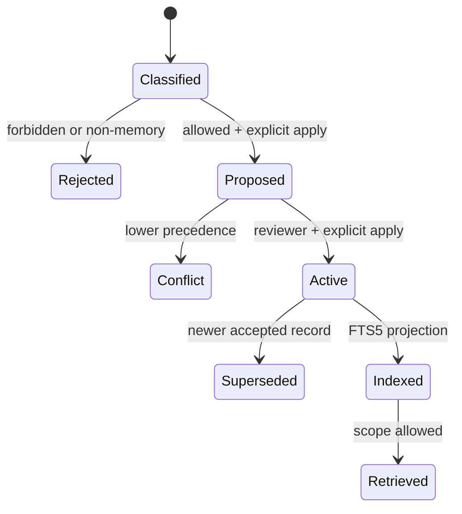

# Memory lifecycle

1. `classify` selects a class and writeback target without mutation.
2. `propose` checks actor/source capability and exact owner/scope alignment, then returns a dry-run; `--apply` creates a candidate and audit event.
3. `promote` revalidates the proposal boundary, reviewer role, provenance-aware precedence, and current active record.
4. A conflict does not rewrite canonical truth.
5. A successful promotion creates a receipt, updates the projection, and preserves provenance.
6. `search` filters by scope; `explain` returns retrieval reason and conflict/staleness signals.

Runtime completion is not durable memory. A fact becomes canonical only after it passes the declared source and promotion boundary.
