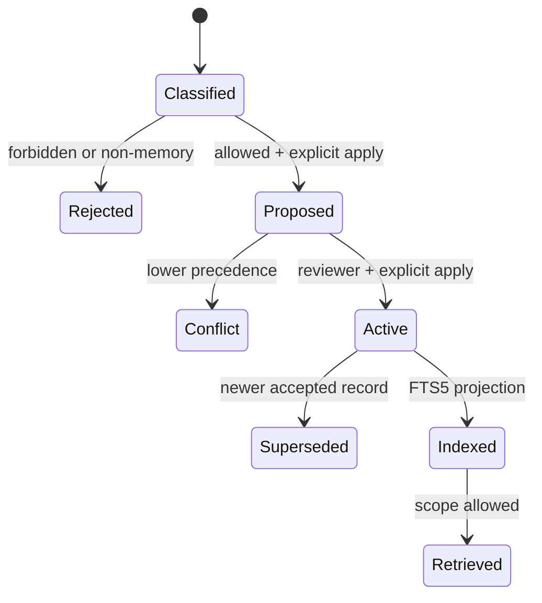

# Memory lifecycle

1. `classify` выбирает class и writeback target.
2. `propose` сначала показывает dry-run; `--apply` создаёт candidate и audit event.
3. `promote` проверяет reviewer role, precedence и текущую active record.
4. Conflict не переписывает canonical truth.
5. Promotion создаёт receipt, обновляет projection и сохраняет provenance.
6. Search фильтрует scope; explain возвращает причину retrieval и сигналы conflict/staleness.
